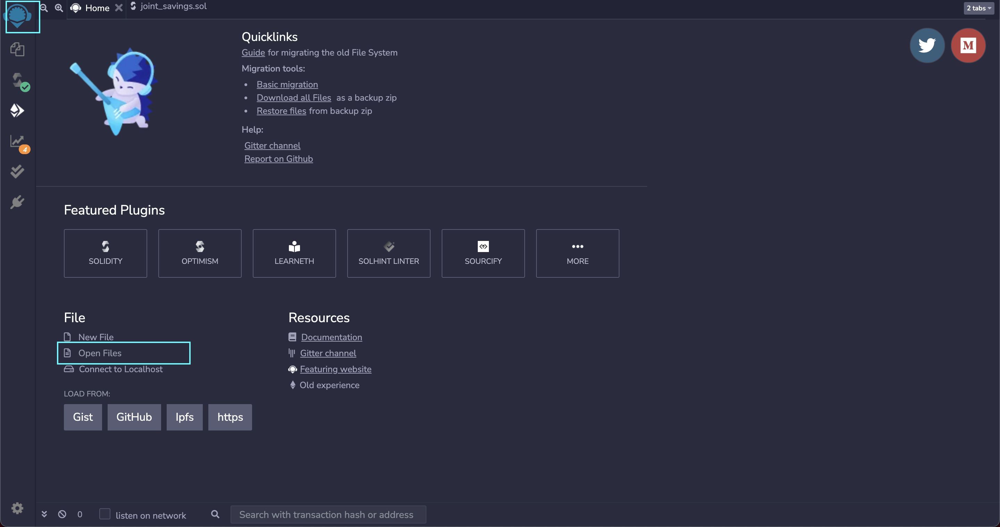
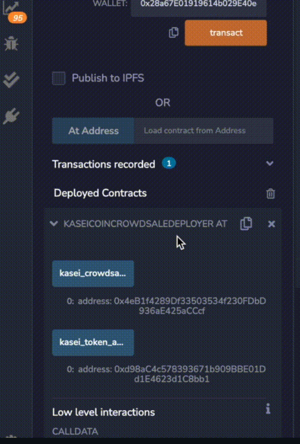
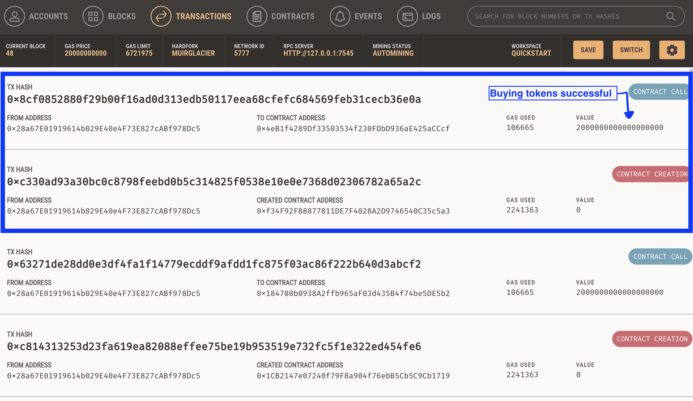

# Module 21 Challenge: Fungible Token Crowdsale

## Table of Contents

[Fungible Token Crowdsale](https://github.com/juzcho/Module_21_Challenge_Fungible_Token_Crowdsale#fungible-token-crowdsale)

[Technologies](https://github.com/juzcho/Module_21_Challenge_Fungible_Token_Crowdsale#technologies)

[Installation Guide](https://github.com/juzcho/Module_21_Challenge_Fungible_Token_Crowdsale#installation-guide)

[Evaluation Evidence](https://github.com/juzcho/Module_21_Challenge_Fungible_Token_Crowdsale#evaluation-evidence)

[Contributors](https://github.com/juzcho/Module_21_Challenge_Fungible_Token_Crowdsale#contributors)

[License](https://github.com/juzcho/Module_21_Challenge_Fungible_Token_Crowdsale#license)

---

## Fungible Token Crowdsale

This project allows us to create a fungible token that is ERC-20 compliant and that will be minted by using a `Crowdsale` contract from the OpenZeppelin Solidity library.

The crowdsale contract that you create will manage the entire crowdsale process, allowing users to send ether to the contract and in return receive KSI, or KaseiCoin tokens. Your contract will mint the tokens automatically and distribute them to buyers in one transaction.

---

## Technologies

This project leverages **[python version 3.8.5](https://www.python.org/downloads/)** with the following packages and modules:

* [pandas](https://pandas.pydata.org/docs/) - *version 1.3.2* - This was used to be able to easily manipulate dataframes and create dataframes.

* [hashlib](https://docs.python.org/3/library/hashlib.html)- This module implements a common interface to many different secure hash and message digest algorithms. In our application, we use SHA256 to return a hexdigest.

* [Solidity](https://docs.soliditylang.org/en/v0.8.9/) - This is used to create the smart contract and implement the joints saving application to work with ether.

* [Remix IDE](https://remix.ethereum.org/) - This is used to be able to write and edit solidity formatted code, and this is where the joints saving application will be launched.

* [MetaMask](https://metamask.io/) - This is a digital wallet and a gateway for the Ethereum blockchain.

* [Ganache](https://www.trufflesuite.com/ganache) - This is a tool that allows us to quickly set up a local blockchain, which we can use to test and develop smart contracts.

* [OpenZeppelin](https://openzeppelin.com/) - OpenZeppelin library provides a wide variety of contracts that are related to the ERC-20 token standard. This also allows us to access the imports for the ERC-20 tokens on the `.sol` files.
---
## Installation Guide

### 1. Install [MetaMask](https://metamask.io/) and create an account. You can also add a Google Chrome extension for this.

### 2. Install [Ganache](https://www.trufflesuite.com/ganache) on your desktop.

### 3. Open the [REMIX IDE](https://remix.ethereum.org/) to view and edit the `KaseiCoin.sol` and `KaseiCoinCrowdsale.sol` file.

- Make sure to `git clone` the file first from this repository. 

### 4. Then when on the REMIX IDE, click on the left icon logo, and then click Open file and navigate to where the git clone files are locally saved on your machine.

- This should open the file through this IDE for you to compile the smart contract.

### 5. Let's compile the `KaseiCoin.sol` and `KaseiCoinCrowdsale.sol` file and make sure that the compiler is version 0.5.7 (or at least anything above version 0.5.5).

### 6. Deploy the Contract in the "Injected Web3" environment.

---

## Evaluation Evidence

### 1. Successful compilation of the `KaseiCoin.sol` Contract, the `KaseiCoinCrowdsale.sol` Contract and the `KaseiCoinCrowdsale Deployer` Contract.

### 2. Deploy the crowdsale to a local blockchain with Remix, MetaMask, and Ganache.

- Deploy the `KaseiCoinCrowdsale.sol` with **KaseiCoin Crowdsale Deployer Contract** using *Injected Web3* environment (which by default the Metamask extension will pop-up). Add the following variables needed such as the  Kasei, KSI, and Wallet address, then click Deploy.

### 3. Test the functionality of the crowdsale by using test accounts to buy new tokens and then checking the balances associated with those accounts. After purchasing tokens with one or more test accounts, view the total supply of minted tokens and the amount of wei that has been raised in the crowdsale contract.
- Go back to the settings and change the contract to **KaseiCoin Crowdsale Contract**. Copy the wallet address under *Crowdsale* shown on the  KaseiCoin Crowdsale Deployer Contract (after deploying) and paste that on the *At Address*. 

- After that, (scroll down) copy and paste the wallet address from Ganache, (scroll up) add the number of ether to buy, then click `Transact`. The weiRaised supply should have the same number of ETH that was bought.

Once you buy the tokens, check your Ganache and Metamask transactions.

- Go back to the settings and change the contract to **KaseiCoin Contract**. Copy the wallet address under *Token* shown on the KaseiCoin Crowdsale Deployer Contract (after deploying) and paste that on the *At Address*.
After that, scroll down to the totalSupply it should have the same number as the weiRaised supply and with the same number of ETH that was bought.

---

## Contributors

Contributed by: Justine Cho

Email: juz317_cho@yahoo.com

[ LinkedIn](https://www.linkedin.com/in/justinecho)

---

## License

### **MIT License**

Copyright (c) [2021] [Justine Cho]

Permission is hereby granted, free of charge, to any person obtaining a copy
of this software and associated documentation files (the "Software"), to deal
in the Software without restriction, including without limitation the rights
to use, copy, modify, merge, publish, distribute, sublicense, and/or sell
copies of the Software, and to permit persons to whom the Software is
furnished to do so, subject to the following conditions:

The above copyright notice and this permission notice shall be included in all
copies or substantial portions of the Software.

THE SOFTWARE IS PROVIDED "AS IS", WITHOUT WARRANTY OF ANY KIND, EXPRESS OR
IMPLIED, INCLUDING BUT NOT LIMITED TO THE WARRANTIES OF MERCHANTABILITY,
FITNESS FOR A PARTICULAR PURPOSE AND NONINFRINGEMENT. IN NO EVENT SHALL THE
AUTHORS OR COPYRIGHT HOLDERS BE LIABLE FOR ANY CLAIM, DAMAGES OR OTHER
LIABILITY, WHETHER IN AN ACTION OF CONTRACT, TORT OR OTHERWISE, ARISING FROM,
OUT OF OR IN CONNECTION WITH THE SOFTWARE OR THE USE OR OTHER DEALINGS IN THE
SOFTWARE.
